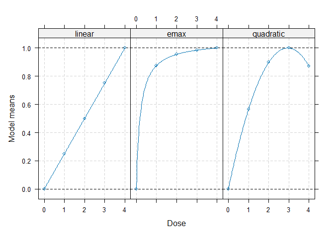
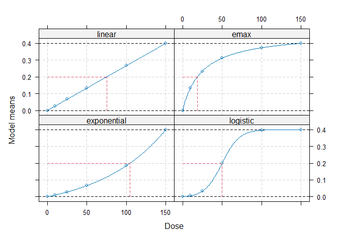

<!-- README.md is generated from README.Rmd. Please edit that file -->

# DoseFinding

<!-- badges: start -->

[](https://CRAN.R-project.org/package=DoseFinding)
[](https://github.com/openpharma/DoseFinding/actions/workflows/R-CMD-check.yaml)
<!-- badges: end -->

The DoseFinding package provides functions for the design and analysis
of dose-finding experiments (for example pharmaceutical Phase II
clinical trials). It provides functions for: multiple contrast tests,
fitting non-linear dose-response models, a combination of testing and
dose-response modelling and calculating optimal designs, both for normal
and general response variable.

## Installation

You can install the development version of DoseFinding from
[GitHub](https://github.com/) with:

``` r
# install.packages("devtools")
devtools::install_github("bbnkmp/DoseFinding")
```

## Examples

### Performing multiple contrast tests

``` r
library(DoseFinding)
data(IBScovars)

## perform (model based) multiple contrast test
## define candidate dose-response shapes
models <- Mods(linear = NULL, emax = 0.2, quadratic = -0.17,
               doses = c(0, 1, 2, 3, 4))
## plot models
plot(models)
```



``` r
## perform multiple contrast test
MCTtest(dose, resp, IBScovars, models=models,
                addCovars = ~ gender)
#> Multiple Contrast Test
#> 
#> Contrasts:
#>   linear   emax quadratic
#> 0 -0.616 -0.889    -0.815
#> 1 -0.338  0.135    -0.140
#> 2  0.002  0.226     0.294
#> 3  0.315  0.252     0.407
#> 4  0.638  0.276     0.254
#> 
#> Contrast Correlation:
#>           linear  emax quadratic
#> linear     1.000 0.768     0.843
#> emax       0.768 1.000     0.948
#> quadratic  0.843 0.948     1.000
#> 
#> Multiple Contrast Test:
#>           t-Stat   adj-p
#> emax       3.208 0.00167
#> quadratic  3.083 0.00250
#> linear     2.640 0.00827
```

### Fitting non-linear dose-response model

``` r
## fit non-linear emax dose-response model
fitemax <- fitMod(dose, resp, data=IBScovars, model="emax",
                  bnds = c(0.01,5))
## display fitted dose-effect curve
plot(fitemax, CI=TRUE, plotData="meansCI")
```


### Optimal designs for dose estimation

``` r
## Calculate optimal designs for target dose (TD) estimation
doses <- c(0, 10, 25, 50, 100, 150)
fmodels <- Mods(linear = NULL, emax = 25, exponential = 85,
                logistic = c(50, 10.8811),
                doses = doses, placEff=0, maxEff=0.4)
plot(fmodels, plotTD = TRUE, Delta = 0.2)
```



``` r
weights <- rep(1/4, 4)
optDesign(fmodels, weights, Delta=0.2, designCrit="TD")
#> Calculated TD - optimal design:
#>       0      10      25      50     100     150 
#> 0.34960 0.09252 0.00366 0.26760 0.13342 0.15319
```
