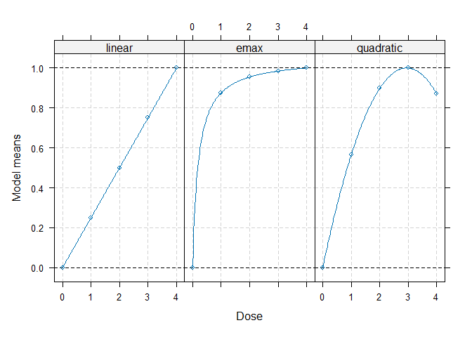
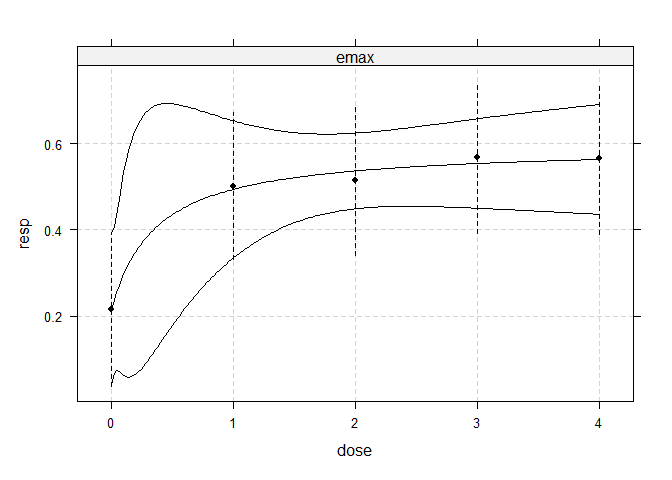
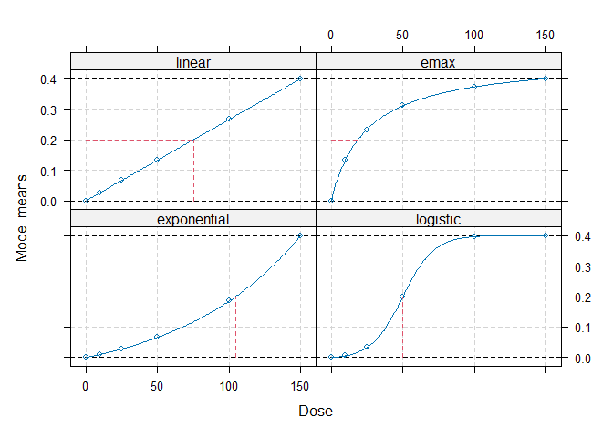

<!-- README.md is generated from README.Rmd. Please edit that file -->

# DoseFinding <a href="https://openpharma.github.io/DoseFinding/"></a>

<!-- badges: start -->

[](https://CRAN.R-project.org/package=DoseFinding)
[](https://github.com/openpharma/DoseFinding/actions/workflows/R-CMD-check.yaml)
<!-- badges: end -->

The DoseFinding package provides functions for the design and analysis
of dose-finding experiments (for example pharmaceutical Phase II
clinical trials). It provides functions for: multiple contrast tests,
fitting non-linear dose-response models, a combination of testing and
dose-response modelling and calculating optimal designs, both for normal
and general response variable. In addition the package can be used to
implement the MCP-Mod procedure, a combination of testing and
dose-response modelling (Bretz et al. ([2005](#ref-bretz2005)), Pinheiro
et al. ([2014](#ref-pinheiro2014))).

## Installation

You can install the development version of DoseFinding from
[GitHub](https://github.com/) with:

``` r
# install.packages("devtools")
devtools::install_github("openpharma/DoseFinding")
```

## Examples

### Performing multiple contrast tests

``` r
library(DoseFinding)
data(IBScovars)

## set random seed to ensure reproducible adj. p-values for multiple contrast test
set.seed(12)

## perform (model based) multiple contrast test
## define candidate dose-response shapes
models <- Mods(linear = NULL, emax = 0.2, quadratic = -0.17,
               doses = c(0, 1, 2, 3, 4))
## plot models
plot(models)
```



``` r
## perform multiple contrast test
MCTtest(dose, resp, IBScovars, models=models,
                addCovars = ~ gender)
#> Multiple Contrast Test
#> 
#> Contrasts:
#>   linear   emax quadratic
#> 0 -0.616 -0.889    -0.815
#> 1 -0.338  0.135    -0.140
#> 2  0.002  0.226     0.294
#> 3  0.315  0.252     0.407
#> 4  0.638  0.276     0.254
#> 
#> Contrast Correlation:
#>           linear  emax quadratic
#> linear     1.000 0.768     0.843
#> emax       0.768 1.000     0.948
#> quadratic  0.843 0.948     1.000
#> 
#> Multiple Contrast Test:
#>           t-Stat   adj-p
#> emax       3.208 0.00128
#> quadratic  3.083 0.00228
#> linear     2.640 0.00848
```

### Fitting non-linear dose-response model

``` r
## fit non-linear emax dose-response model
fitemax <- fitMod(dose, resp, data=IBScovars, model="emax",
                  bnds = c(0.01,5))
## display fitted dose-effect curve
plot(fitemax, CI=TRUE, plotData="meansCI")
```



### Optimal designs for dose estimation

``` r
## Calculate optimal designs for target dose (TD) estimation
doses <- c(0, 10, 25, 50, 100, 150)
fmodels <- Mods(linear = NULL, emax = 25, exponential = 85,
                logistic = c(50, 10.8811),
                doses = doses, placEff=0, maxEff=0.4)
plot(fmodels, plotTD = TRUE, Delta = 0.2)
```



``` r
weights <- rep(1/4, 4)
optDesign(fmodels, weights, Delta=0.2, designCrit="TD")
#> Calculated TD - optimal design:
#>       0      10      25      50     100     150 
#> 0.34960 0.09252 0.00366 0.26760 0.13342 0.15319
```

## Contributors

This package was originally developed in 2010 and over the years has had
many different contributors. Some of the work on this package predates
its Github repository and we want to list here all contributors to the
package and highlight their contributions in addition to the “official””
package authors and maintainers as listed in the `DESCRIPTION` file.

### Maintainers

- Marius Thomas — current maintainer
- Björn Bornkamp — former maintainer (until 2024)

### Original core package authors

- Björn Bornkamp
- Jose Pinheiro
- Frank Bretz

### Other authors and substantial contributors

- Ludger Sandig — Vignettes
- Marius Thomas — Bayesian MCP-mod, various updates to code, docs, and
  tests
- Daniel Sabanes Bove — powMCTInterim implementation, longitudinal data
  vignette
- Carina Miller - Time-to-event vignette

## References

<div id="refs" class="references csl-bib-body hanging-indent"
entry-spacing="0">

<div id="ref-bretz2005" class="csl-entry">

Bretz, F., Pinheiro, J. C., and Branson, M. (2005), “Combining multiple
comparisons and modeling techniques in dose-response studies,”
*Biometrics*, Wiley Online Library, 61, 738–748.
<https://doi.org/10.1111/j.1541-0420.2005.00344.x>.

</div>

<div id="ref-pinheiro2014" class="csl-entry">

Pinheiro, J., Bornkamp, B., Glimm, E., and Bretz, F. (2014),
“Model-based dose finding under model uncertainty using general
parametric models,” *Statistics in Medicine*, 33, 1646–1661.
<https://doi.org/10.1002/sim.6052>.

</div>

</div>
