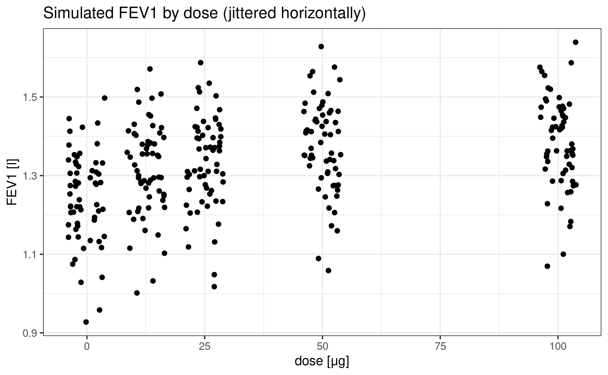
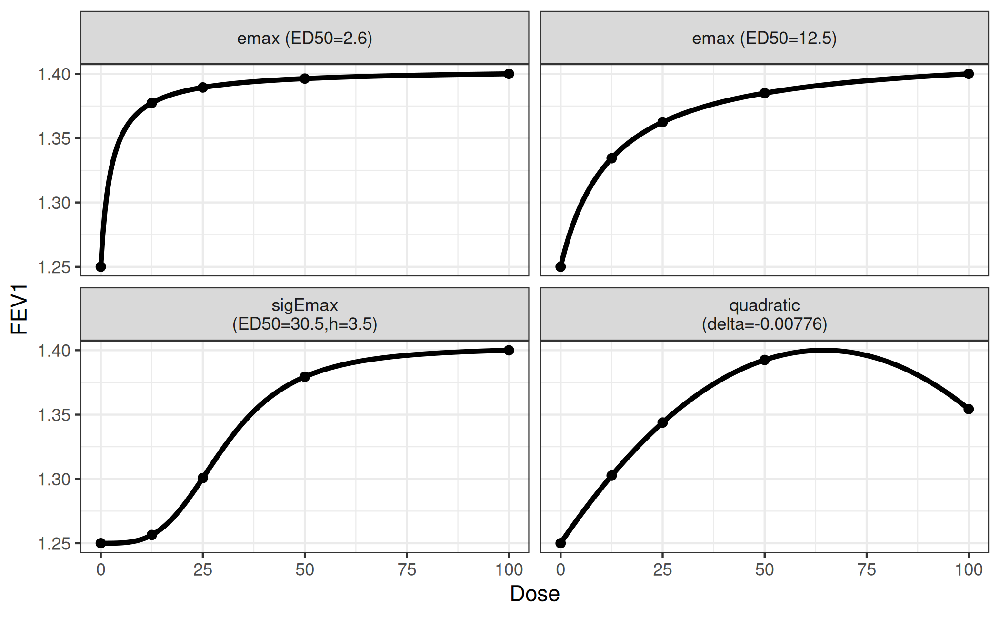
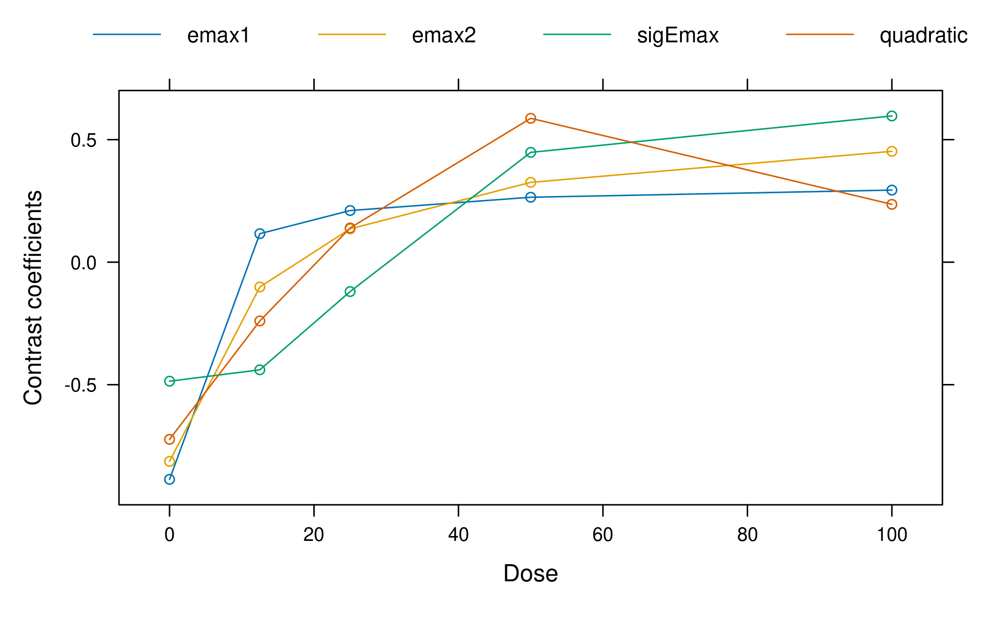
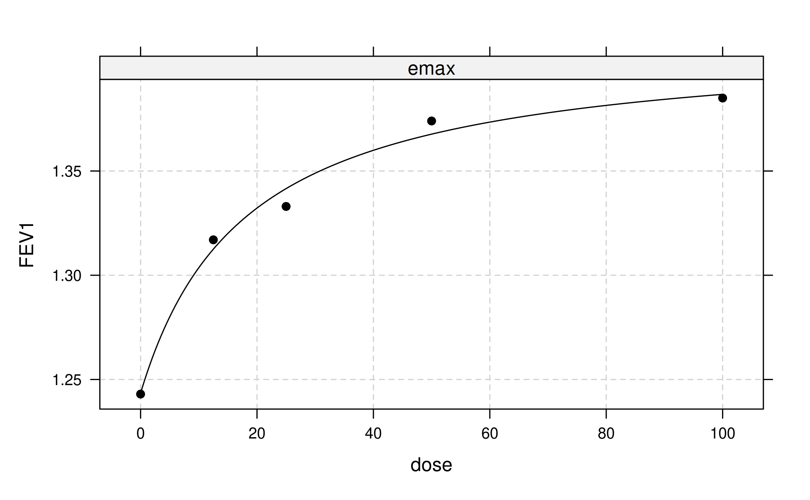
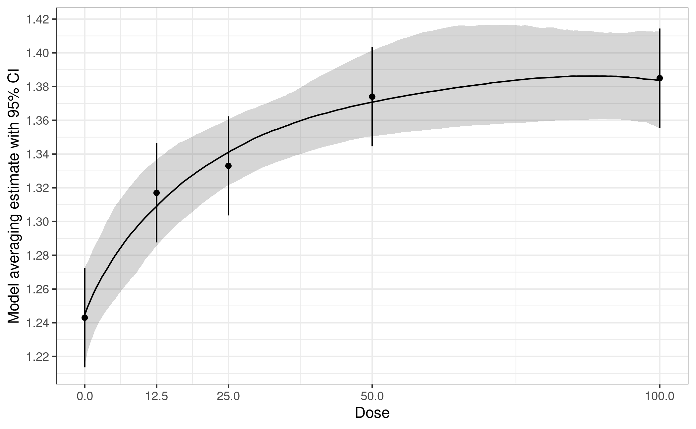

# Continuous data MCP-Mod

## Background and Data

In this vignette we will illustrate the usage of the DoseFinding package
for analyzing continuously distributed data. There is a separate
vignette with details on [sample size and power
calculation](https://openpharma.github.io/DoseFinding/articles/sample_size.md).

We will use data from Verkindre et al. ([2010](#ref-verkindre2010)), who
actually use a cross-over design and utilize MCP-Mod in a supportive
analysis. More information can be found at the corresponding
[clinicaltrials.gov
page](https://www.clinicaltrials.gov/study/NCT00501852) and on the R
help page
[`?glycobrom`](https://openpharma.github.io/DoseFinding/reference/glycobrom.md).

The main purpose Verkindre et al. ([2010](#ref-verkindre2010)) was to
provide safety and efficacy data on Glycopyrronium Bromide (NVA237) in
patients with stable Chronic Obstructive Pulmonary Disease
([COPD](https://en.wikipedia.org/wiki/Chronic_obstructive_pulmonary_disease)).
The primary endpoint in this study was the mean of two measurements of
forced expiratory volume in 1 second
([FEV1](https://en.wikipedia.org/wiki/FEV1#Forced_expiratory_volume_in_1_second_(FEV1)))
at 23h 15min and 23h 45min post dosing, following 7 days of treatment.

In order to keep this exposition simple, we will ignore the active
control and focus on the placebo group and the four dose groups (12.5,
25, 50, and 100μg).

For the purpose here, we recreate a dataset that mimicks a parallel
group design, based on the published summary statistics. These can be
found in the `glycobrom` dataset coming with the `DoseFinding` package.
Here `fev1` and `sdev` contain the mean and standard deviation of the
mean (standard error) of the primary endpoint for each group, while `n`
denotes the number of participants.

``` r
library(DoseFinding)
data(glycobrom)
print(glycobrom)
```

       dose  fev1   sdev  n
    1   0.0 1.243 0.0156 49
    2  12.5 1.317 0.0145 55
    3  25.0 1.333 0.0151 51
    4  50.0 1.374 0.0148 53
    5 100.0 1.385 0.0148 53

We want to create a dataset with 60 participants in each of the five
groups. Noticing that the standard errors are essentially equal across
all groups, we draw five vectors of measurement errors centered at `0`
with identical variances `60 * 0.015^2` which we add to the observed
means.

Note that here we use
[`MASS::mvrnorm`](https://rdrr.io/pkg/MASS/man/mvrnorm.html) instead of
`rnorm` because it lets us generate random numbers with the specified
*sample* mean and sd.

``` r
set.seed(1, kind = "Mersenne-Twister", sample.kind = "Rejection", normal.kind = "Inversion")
rand <- rep(MASS::mvrnorm(60, 0, 60 * 0.015^2, empirical = TRUE), 5)
NVA <- data.frame(dose = rep(glycobrom$dose, each = 60),
                  FEV1 = rep(glycobrom$fev1, each = 60) + rand)
ggplot(NVA) + geom_jitter(aes(dose, FEV1), height = 0, width = 4) +
  labs(title = "Simulated FEV1 by dose (jittered horizontally)") +
  xlab("dose [μg]") + ylab("FEV1 [l]")
```



## Design stage

Now let’s forget we already saw the data and imagine we had to design
this trial with MCP-Mod.

First we decide that we want to include two Emax models, one sigmoid
Emax model and one quadratic model in the analysis (see
[`?drmodels`](https://openpharma.github.io/DoseFinding/reference/drmodels.md)
for other choices). While the (sigmoid) Emax type covers monotonic
dose-response-relationships, the quadratic model is there to accommodate
a potentially decreasing effect at high doses.

Next we have to supply guesstimates for the nonlinear parameters:

- ED50 for an Emax model
- ED50 and the Hill parameter h for a sigmoid emax model
- coefficient ratio \\\delta = \beta_2/\lvert\beta_1\rvert\\ in the
  quadratic model \\f(d, \theta) = E_0 + \beta_1 d + \beta_2 d^2\\

The following choices cover a range of plausible relationships:

- ED50 = 2.6 and ED25 = 12.5 for the Emax models (all doses have
  substantive effects)
- ED50 = 30.5 and h = 3.5 for the sigEmax model (first dose has a
  negligible effect)
- delta = -0.00776 for the quadratic model (downturn for the fourth
  dose)

We also fix the effect of placebo at an FEV1 of `1.25` liters and the
maximum effect at `0.15` liters above placebo. This implicitly sets the
common linear parameters of all the models.

Note the syntax of the arguments to the `Mods` function:
`emax = c(2.6, 12.5)` specifies *two* Emax models, but
`sigEmax = c(30.5, 3.5)` only specifies *one* Sigmoid Emax model.

``` r
doses <- c(0, 12.5, 25, 50, 100)
mods <- Mods(emax = c(2.6, 12.5), sigEmax = c(30.5, 3.5), quadratic = -0.00776,
             placEff = 1.25, maxEff = 0.15, doses = doses)
```

It’s always a good idea to perform a visual sanity check of the
functional relationships implied by the guesstimates.

``` r
plotMods(mods, ylab = "FEV1")
```



This concludes the design phase.

We can also take a look at the calculated optimal contrasts. Each
contrast has maximum power to detect a non-flat effect profile in the
hypothetical world where the particular guesstimate is actually the true
value.

``` r
optC <- optContr(mods, w=1)
print(optC)
```

    Optimal contrasts
          emax1  emax2 sigEmax quadratic
    0    -0.886 -0.813  -0.486    -0.723
    12.5  0.116 -0.101  -0.439    -0.240
    25    0.211  0.136  -0.120     0.140
    50    0.265  0.326   0.448     0.587
    100   0.294  0.452   0.597     0.236

``` r
plot(optC)
```



It can be seen that in the balanced sample size case and equal variance
assumed for each dose group, the optimal contrasts reflect the
underlying assumed mean dose-response shape. This is no surprise, given
that the optimal contrasts are given by \\ c^{\textrm{opt}} \propto
S^{-1}\biggl(\mu^0_m - \frac{(\mu^0_m)^T S^{-1}1_K}{1_K^T S^{-1}
1_K}\biggr) \\ where \\\mu^0_m\\ is the standardized mean response,
\\K\\ is the number doses, and \\1_K\\ is an all-ones vector of length
\\K\\ and \\S\\ is the covariance matrix of the estimates at the doses
(see [Pinheiro et al. 2014](#ref-pinheiro2014) for a detailed account).
As we have equal variance in all dose groups in our case and no
correlation, the optimal contrasts are all proportional to the shapes of
the candidate model mean vectors. As the standardized model is used in
the formula, the values of the linear parameters of the models do not
impact the optimal contrasts.

## Analysis stage

Now fast-forward to the time when we have collected the data.

### Multiple comparisons

We run the multiple contrast test with the pre-specified models. Note
that the `type` parameter defaults to `type="normal"`, which means that
we assume a homoscedastic ANOVA model for `FEV1`, i.e. critical values
are taken from a multivariate t distribution. Further note that when
`data` is supplied, the first two arguments `dose` and `FEV1` are *not
evaluated*, but symbolically refer to the columns in `data=NVA`.

``` r
test_normal <- MCTtest(dose = dose, resp = FEV1, models = mods, data = NVA)
print(test_normal)
```

    Multiple Contrast Test

    Contrasts:
          emax1  emax2 sigEmax quadratic
    0    -0.886 -0.813  -0.486    -0.723
    12.5  0.116 -0.101  -0.439    -0.240
    25    0.211  0.136  -0.120     0.140
    50    0.265  0.326   0.448     0.587
    100   0.294  0.452   0.597     0.236

    Contrast Correlation:
              emax1 emax2 sigEmax quadratic
    emax1     1.000 0.957   0.648     0.867
    emax2     0.957 1.000   0.839     0.929
    sigEmax   0.648 0.839   1.000     0.844
    quadratic 0.867 0.929   0.844     1.000

    Multiple Contrast Test:
              t-Stat  adj-p
    emax2      7.443 <0.001
    quadratic  7.016 <0.001
    emax1      6.937 <0.001
    sigEmax    6.676 <0.001

The test results suggest a clear dose-response trend.

Alternatively we can use generalized MCP-Mod (see the FAQ for the
[difference](https://openpharma.github.io/DoseFinding/articles/faq.md)).
We use R’s builtin [`lm()`](https://rdrr.io/r/stats/lm.html) function to
manually fit the ANOVA model and extract estimates for the model
coefficients and their covariance matrix. We also need the model degrees
of freedom.

``` r
fitlm <- lm(FEV1 ~ factor(dose) - 1, data = NVA)
mu_hat <- coef(fitlm)
S_hat <- vcov(fitlm)
anova_df <- fitlm$df.residual
```

Next we supply them to the `MCTtest` function together with
`type="general"`. Note that in contrast to the invocation above we here
supply the `doses` and the estimates `mu_hat` and `S_hat` directly and
not within a `data.frame`.

``` r
test_general <- MCTtest(dose = doses, resp = mu_hat, S = S_hat, df = anova_df,
                        models = mods, type = "general")
print(test_general)
```

    Multiple Contrast Test

    Contrasts:
          emax1  emax2 sigEmax quadratic
    0    -0.886 -0.813  -0.486    -0.723
    12.5  0.116 -0.101  -0.439    -0.240
    25    0.211  0.136  -0.120     0.140
    50    0.265  0.326   0.448     0.587
    100   0.294  0.452   0.597     0.236

    Contrast Correlation:
              emax1 emax2 sigEmax quadratic
    emax1     1.000 0.957   0.648     0.867
    emax2     0.957 1.000   0.839     0.929
    sigEmax   0.648 0.839   1.000     0.844
    quadratic 0.867 0.929   0.844     1.000

    Multiple Contrast Test:
              t-Stat  adj-p
    emax2      7.443 <0.001
    quadratic  7.016 <0.001
    emax1      6.937 <0.001
    sigEmax    6.676 <0.001

For the simple ANOVA case at hand the results of the original and the
generalized MCP-Mod approaches actually coincide. The p-values differ
due to the numerical methods used for obtaining them.

``` r
cbind(normal = test_normal$tStat, generalized = test_general$tStat)
```

                normal generalized
    emax1     6.937000    6.937000
    emax2     7.442849    7.442849
    sigEmax   6.675739    6.675739
    quadratic 7.016303    7.016303

``` r
cbind(normal = attr(test_normal$tStat, "pVal"), generalized = attr(test_general$tStat, "pVal"))
```

               normal  generalized
    [1,] 1.221279e-11 1.224099e-11
    [2,] 5.375700e-13 6.030731e-13
    [3,] 5.924716e-11 6.039769e-11
    [4,] 8.166245e-12 7.672307e-12

## Dose-response estimation

In the simplest case we would now proceed to fit only a single model
type, for example the one with the largest t-statistic (or alternatively
smallest AIC or BIC):

``` r
fit_single <- fitMod(dose, FEV1, NVA, model = "emax")
plot(fit_single)
```



But actually we want to use a more robust approach that combines
bootstrapping with model averaging in the generalized MCP-Mod framework.

First we draw bootstrap samples from the multivariate normal
distribution of the estimates originating from the first-stage model.
Next, for each bootstrapped data set we fit our candidate models, select
the one with lowest AIC and save the corresponding estimated quantities
of interest. This selection step implies that the bootstrap samples
potentially come from different models. Finally we use these
bootstrapped estimates for inference. For example, we can estimate a
dose-response curve by using the median over the bootstrapped means at
each dose. Similarly we can derive confidence intervals based on
bootstrap quantiles. Inference for other quantities of interest can be
performed in an analogous way.

As different models contribute to the bootstrap resamples, the approach
can be considered more robust than simple model selection (see also
[Schorning et al. 2016](#ref-schorning2016) for simulations on this
topic).

Now let’s apply this general idea to the case at hand. Our first-stage
model is an ANOVA, and we’re interested in an estimate of the
dose-response curve plus confidence intervals. Our set of candidate
model types consists of Emax, sigEmax and quadratic.

We us R’s builtin [`lm()`](https://rdrr.io/r/stats/lm.html) function to
fit an ANOVA model without intercept and extract estimates for the model
coefficients and their covariance matrix.

``` r
fitlm <- lm(FEV1 ~ factor(dose) - 1, data = NVA)
dose <- unique(NVA$dose)
mu_hat <- coef(fitlm)
S_hat <- vcov(fitlm)
```

The bootstrap procedure described above is implemented in the `maFitMod`
function. Note that for technical reasons we have to supply boundaries
to the fitting algorithm via the `bnds` argument to `maFitMod` (see
[`?fitMod`](https://openpharma.github.io/DoseFinding/reference/fitMod.md)
and
[`?defBnds`](https://openpharma.github.io/DoseFinding/reference/defBnds.md)
for details).

``` r
fit_mod_av <- maFitMod(dose, mu_hat, S = S_hat,
                       models = c("emax", "sigEmax", "quadratic"))
```

With the `predict` method we can obtain the predictions from the fitted
model on each boostrap sample. The `plot` method allows to summarize the
model fits (some limited customization is possible see
[`?plot.maFit`](https://openpharma.github.io/DoseFinding/reference/maFitMod.md)).

``` r
# point estimates (median) and bootstrap quantile intervals can be extracted via
ma_pred <- predict(fit_mod_av, doseSeq = c(0, 12.5, 25, 50, 100))
# individual bootstrap estimates via
indiv_pred <- predict(fit_mod_av, doseSeq = c(0, 12.5, 25, 50, 100),
                      summaryFct = NULL)
# plotting can be done via
plot(fit_mod_av, plotData = "meansCI",
     ylab = "Model averaging estimate with 95% CI")
```



## How to adjust for covariates?

In all practical situations covariates will be used to adjust for in the
analysis. The MCP step can then be performed for example by including
the covariates in the `addCovars` argument. Another approach to perform
the MCP step is based on the differences to placebo: In a first stage
`lm(.)` is fit *with* an intercept included. Then the treatment
differences and corresponding covariance matrix would be extracted. This
could then be fed into the `MCTtest` function, with the `placAdj = TRUE`
argument, see
[`?MCTtest`](https://openpharma.github.io/DoseFinding/reference/MCTtest.md)
for an example. Both approaches will give the same result.

A third alternative is to calculate the adjusted means (and
corresponding covariance matrix) and then perform generalized MCP-Mod
based on these estimates (following the same steps as in the unadjusted
analysis above, but adding the `type = "general"` argument as well as
the estimated covariance matrix via `S`). The procedure is very similar
to the situation explained in detail in the vignette for the [analysis
of binary
data](https://openpharma.github.io/DoseFinding/articles/binary_data.md),
so not repeated here.

For the case of normally distributed data adjusted means are calculated
by predicting the outcome (using the covariate adjusted model) of each
patient in the study under every dose, and then averaging over all
patients per dose.

## References

Pinheiro, J., Bornkamp, B., Glimm, E., and Bretz, F. (2014),
“Model-based dose finding under model uncertainty using general
parametric models,” *Statistics in Medicine*, 33, 1646–1661.
<https://doi.org/10.1002/sim.6052>.

Schorning, K., Bornkamp, B., Bretz, F., and Dette, H. (2016), “Model
selection versus model averaging in dose finding studies,” *Statistics
in Medicine*, 35, 4021–4040. <https://doi.org/10.1002/sim.6991>.

Verkindre, C., Fukuchi, Y., Flémale, A., Takeda, A., Overend, T.,
Prasad, N., and Dolker, M. (2010), “Sustained 24-h efficacy of NVA237, a
once-daily long-acting muscarinic antagonist, in COPD patients,”
*Respiratory Medicine*, 104, 1482–1489.
<https://doi.org/10.1016/j.rmed.2010.04.006>.
