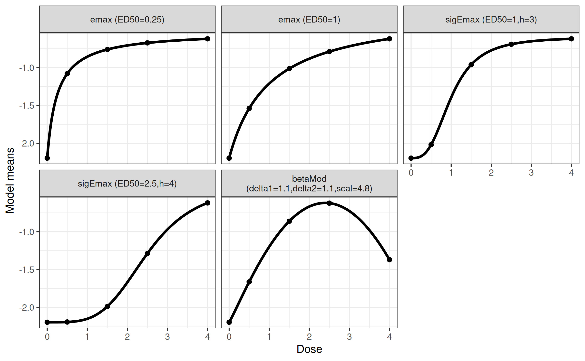
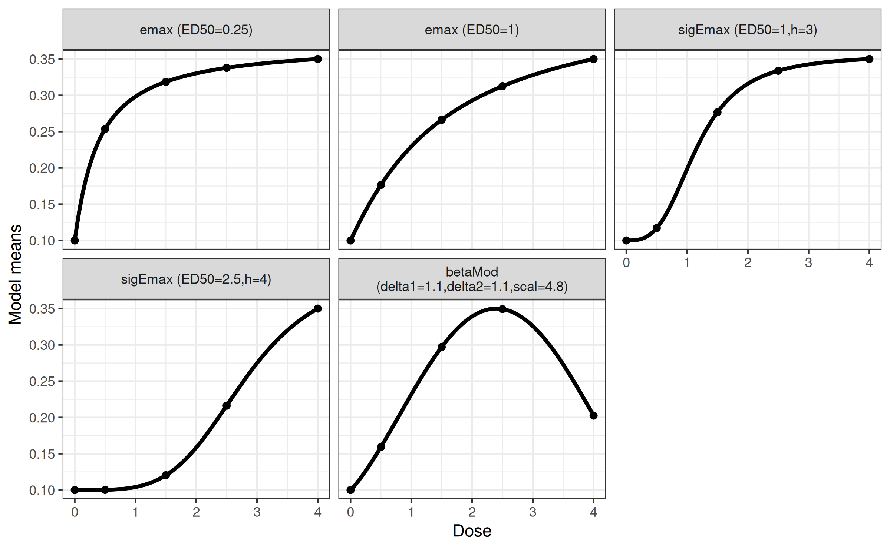
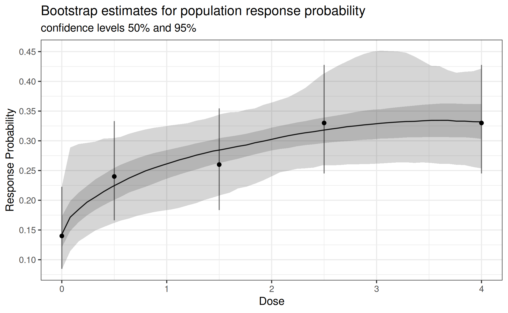
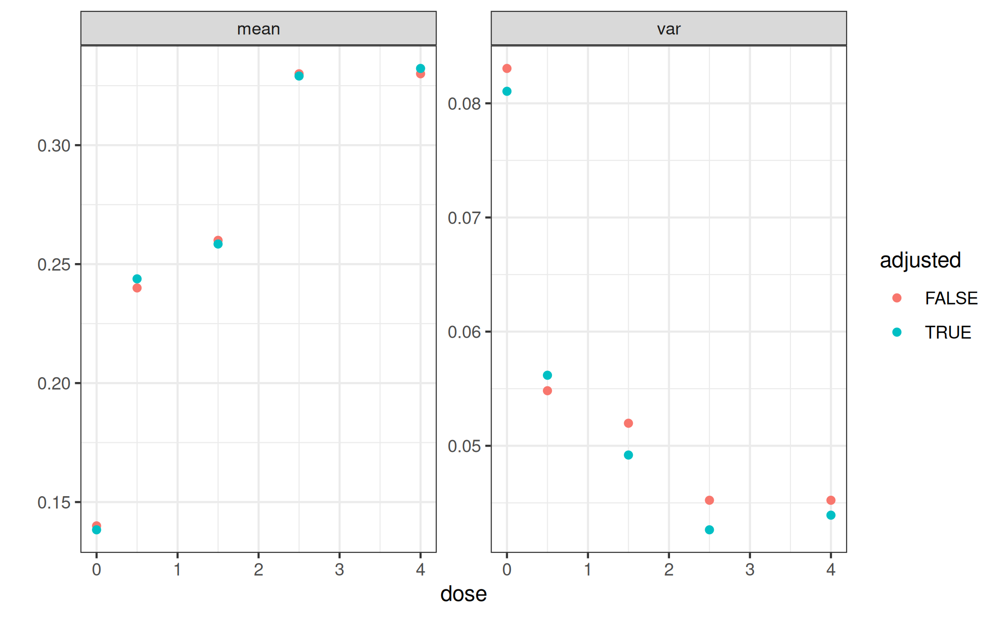
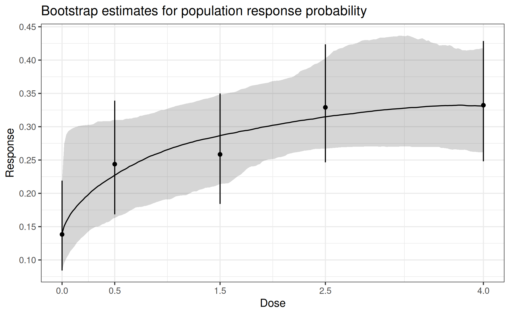
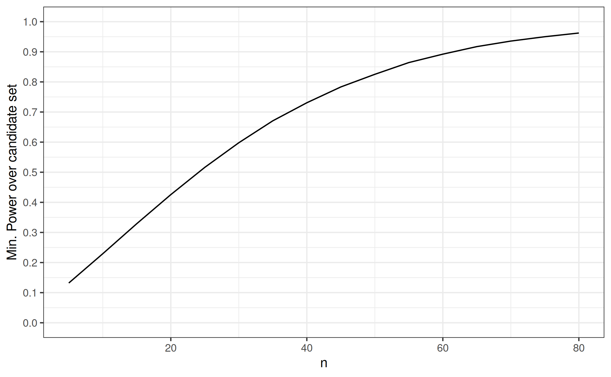

# Binary Data MCP-Mod

In this vignette we illustrate how to use the DoseFinding package with
binary observations by fitting a first-stage GLM and applying the
generalized MCP-Mod methodology to the resulting estimates. We also show
how to deal with covariates.

For continuously distributed data see [the corresponding
vignette](https://openpharma.github.io/DoseFinding/articles/analysis_normal.md).

## Background and data set

Assume a dose-finding study is planned for an hypothetical
investigational treatment in atopic dermatitis, for the binary endpoint
Investigator’s Global Assessment (IGA). The treatment is tested with
doses 0, 0.5, 1.5, 2.5, 4. It is assumed the response rate for placebo
will be around 10%, while the response rate for the top dose may be 35%.
This is an example where the generalized MCP-Mod approach can be
applied, i.e. dose-response testing and estimation will be performed on
the logit scale.

We generate some example data in the setting just described. The 10%
placebo effect translates to -2.2 on the logit scale, and the asymptotic
effect of 25 percentage points above placebo becomes
`logit(0.35) - logit(0.1)`, approximately 1.6.

``` r

library(DoseFinding)
library(ggplot2)

logit <- function(p) log(p / (1 - p))
inv_logit <- function(y) 1 / (1 + exp(-y))
doses <- c(0, 0.5, 1.5, 2.5, 4)

## set seed and ensure reproducibility across R versions
set.seed(1, kind = "Mersenne-Twister", sample.kind = "Rejection", normal.kind = "Inversion")
group_size <- 100
dose_vector <- rep(doses, each = group_size)
N <- length(dose_vector)
## generate covariates
x1 <- rnorm(N, 0, 1)
x2 <- factor(sample(c("A", "B"), N, replace = TRUE, prob = c(0.6, 0.4)))
## assume approximately logit(10%) placebo and logit(35%) asymptotic response with ED50=0.5
prob <- inv_logit(emax(dose_vector, -2.2, 1.6, 0.5) + 0.3 * x1 + 0.3 * (x2 == "B"))
dat <- data.frame(y = rbinom(N, 1, prob),
                  dose = dose_vector, x1 = x1, x2 = x2)
```

## Candidate models

We will use the following candidate set of models for the mean response
on the logit scale:

``` r

mods <- Mods(emax = c(0.25, 1), sigEmax = rbind(c(1, 3), c(2.5, 4)), betaMod = c(1.1, 1.1),
             placEff = logit(0.1), maxEff = logit(0.35)-logit(0.1),
             doses = doses)
plotMods(mods)
```



``` r

## plot candidate models on probability scale
plotMods(mods, trafo = inv_logit)
```



## Analysis without covariates

First assume covariates had not been used in the analysis (not
recommended in practice). Let \\\mu_k\\ denote the logit response
probability at dose \\k\\, so that for patient \\j\\ in group \\k\\ we
have

\\ \begin{aligned} Y\_{kj} &\sim \mathrm{Bernoulli}(p\_{kj}) \\
\mathrm{logit}(p\_{kj}) &= \mu\_{k} \end{aligned} \\

We perform the MCP-Mod test on the logit scale estimates
\\\hat\mu=(\hat\mu_1,\dots,\hat\mu_K)\\ and their estimated covariance
matrix \\\hat S\\. We can extract both from the object returned by the
[`glm()`](https://rdrr.io/r/stats/glm.html) call.

``` r

fit_nocov <- glm(y~factor(dose) + 0, data = dat, family = binomial)
mu_hat <- coef(fit_nocov)
S_hat <- vcov(fit_nocov)
MCTtest(doses, mu_hat, S = S_hat, models = mods, type = "general")
```

    Multiple Contrast Test

    Contrasts:
         emax1  emax2 sigEmax1 sigEmax2 betaMod
    0   -0.817 -0.641   -0.471   -0.280  -0.540
    0.5 -0.126 -0.377   -0.589   -0.423  -0.356
    1.5  0.202  0.103    0.163   -0.300   0.358
    2.5  0.338  0.365    0.418    0.228   0.662
    4    0.402  0.550    0.479    0.775  -0.124

    Contrast Correlation:
             emax1 emax2 sigEmax1 sigEmax2 betaMod
    emax1    1.000 0.945    0.831    0.608   0.789
    emax2    0.945 1.000    0.956    0.805   0.762
    sigEmax1 0.831 0.956    1.000    0.804   0.788
    sigEmax2 0.608 0.805    0.804    1.000   0.327
    betaMod  0.789 0.762    0.788    0.327   1.000

    Multiple Contrast Test:
             t-Stat   adj-p
    emax2     3.378 0.00104
    emax1     3.349 0.00103
    sigEmax1  3.047 0.00305
    sigEmax2  2.668 0.01108
    betaMod   2.631 0.01169

Dose-response modeling then can proceed with a combination of
bootstrapping and model averaging. For detailed explanations refer to
the [vignette for analysis of continuous
data](https://openpharma.github.io/DoseFinding/articles/analysis_normal.md).
Fitting is done on the logit scale, for plotting transfer the fit back
to the probability scale.

``` r

fit_mod_av <- maFitMod(doses, mu_hat, S = S_hat,
                       models = c("emax", "sigEmax", "betaMod"))
plot(fit_mod_av, plotData = "meansCI",
     title = "Bootstrap estimates for population response probability",
     trafo = function(x) 1/(1+exp(-x)))
```



## Analysis with covariates

In many situations there are important prognostic covariates (main
effects) to adjust for in the analysis. Denote the vector of these
additional covariates for patient \\j\\ with \\x\_{kj}\\.

\\ \begin{aligned} Y\_{kj} &\sim \mathrm{Bernoulli}(p\_{kj}) \\
\mathrm{logit}(p\_{kj}) &= \mu_k^d + x\_{kj}^T\beta \end{aligned} \\

Fitting this model gives us estimated coefficients \\\hat\mu=(\hat\mu^d,
\hat\beta)\\ and an estimate \\\hat S\\ of the covariance matrix of the
estimator \\\hat\mu\\.

In principle we could perform testing and estimation based on
\\\hat\mu^d\\ and the corresponding sub-matrix of \\\hat S\\, but this
would produce estimates for a patient with covariate vector \\\beta=0\\,
and not reflect the overall population.

To produce adjusted estimates per dose and to accommodate potential
systematic differences in the covariates we predict the mean response
probability at dose k for all observed values of the covariates and
transform back to logit scale:

\\ \mu^\*\_k := \mathrm{logit}\biggl(\frac{1}{n} \sum\_{i=1}^n
\mathrm{logit}^{-1}(\hat\mu^d_k + x\_{i}^T\hat\beta)\biggr) \\

Note here we index \\x\\ with \\i\\ that runs from 1 to \\n\\ (all
patients randomized in the study).

To obtain a variance estimate for \\\mu^\*\\ we repeat this with draws
from \\\mathrm{MultivariateNormal}(\hat\mu, \hat S)\\ and calculate the
empirical covariance matrix \\S^\*\\ of theses draws.

Then we use \\\mu^\*\\ and \\S^\*\\ in
[`MCTtest()`](https://openpharma.github.io/DoseFinding/reference/MCTtest.md).

``` r

fit_cov <- glm(y~factor(dose) + 0 + x1 + x2, data = dat, family = binomial)

covariate_adjusted_estimates <- function(mu_hat, S_hat, formula_rhs, doses, other_covariates, n_sim) {
  ## predict every patient under *every* dose
  oc_rep <- as.data.frame(lapply(other_covariates, function(col) rep(col, times = length(doses))))
  d_rep <- rep(doses, each = nrow(other_covariates))
  pdat <- cbind(oc_rep, dose = d_rep)
  X <- model.matrix(formula_rhs, pdat)
  ## average on probability scale then backtransform to logit scale
  mu_star <- logit(tapply(inv_logit(X %*% mu_hat), pdat$dose, mean))
  ## estimate covariance matrix of mu_star
  pred <- replicate(n_sim, logit(tapply(inv_logit(X %*% drop(mvtnorm::rmvnorm(1, mu_hat, S_hat))),
                                        pdat$dose, mean)))
  return(list(mu_star = as.numeric(mu_star), S_star = cov(t(pred))))
}

ca <- covariate_adjusted_estimates(coef(fit_cov), vcov(fit_cov), ~factor(dose)+0+x1+x2,
                                   doses, dat[, c("x1", "x2")], 1000)
MCTtest(doses, ca$mu_star, S = ca$S_star, type = "general", models = mods)
```

    Multiple Contrast Test

    Contrasts:
         emax1  emax2 sigEmax1 sigEmax2 betaMod
    0   -0.828 -0.659   -0.494   -0.277  -0.551
    0.5 -0.067 -0.317   -0.546   -0.369  -0.299
    1.5  0.131  0.021    0.090   -0.372   0.315
    2.5  0.384  0.412    0.470    0.251   0.694
    4    0.381  0.543    0.480    0.766  -0.160

    Contrast Correlation:
             emax1 emax2 sigEmax1 sigEmax2 betaMod
    emax1    1.000 0.945    0.829    0.598   0.785
    emax2    0.945 1.000    0.954    0.799   0.750
    sigEmax1 0.829 0.954    1.000    0.797   0.777
    sigEmax2 0.598 0.799    0.797    1.000   0.299
    betaMod  0.785 0.750    0.777    0.299   1.000

    Multiple Contrast Test:
             t-Stat   adj-p
    emax2     3.491 < 0.001
    emax1     3.471 < 0.001
    sigEmax1  3.115 0.00238
    sigEmax2  2.749 0.00888
    betaMod   2.639 0.01215

In the case at hand the results here are not dramatically different.
Adjusting for covariates gives slightly lower variance estimates.

``` r

ggplot(data.frame(dose = rep(doses, 4),
                  est = c(inv_logit(mu_hat), diag(S_hat), inv_logit(ca$mu_star), diag(ca$S_star)),
                  name = rep(rep(c("mean", "var"), each = length(doses)), times = 2),
                  a = rep(c(FALSE, TRUE), each = 2*length(doses)))) +
  geom_point(aes(dose, est, color = a)) +
  scale_color_discrete(name = "adjusted") +
  facet_wrap(vars(name), scales = "free_y") + ylab("")
```



Dose-response modelling proceeds in the same way as before, but now on
the adjusted estimates.

``` r

fit_cov_adj <- maFitMod(doses, ca$mu_star, S = ca$S_star,
                        models = c("emax", "sigEmax", "betaMod"))
# plotting on probability scale, need to transform predictions on logit scale
plot(fit_cov_adj, plotData = "meansCI",
     title = "Bootstrap estimates for population response probability",
     trafo = function(x) 1/(1+exp(-x)))
```



## Avoiding problems with complete seperation and 0 responders

In a number of situations it makes sense to replace ML estimation for
logistic regression via `glm(..., family=binomial)`, with the Firth
logistic regression (see [Heinze and Schemper 2002](#ref-heinze2002)),
implemented as the `logistf` function from the `logistf` package. This
is particularly important for small sample size per dose and if small
number of responses are expected on some treatment arms. The estimator
of Firth regression corresponds to the posterior mode in a Bayesian
logistic regression model with Jeffrey’s prior on the parameter vector.
This estimator is well defined even in situations where the ML estimate
for logistic regression does not exist (e.g. for complete separation).

## Considerations around optimal contrasts at design stage and analysis stage

The formula for the optimal contrasts is given by \\ c^{\textrm{opt}}
\propto S^{-1}\biggl(\mu^0_m - \frac{(\mu^0_m)^T S^{-1}1_K}{1_K^T S^{-1}
1_K}\biggr) \\ where \\\mu^0_m\\ is the standardized mean response,
\\K\\ is the number doses, and \\1_K\\ is an all-ones vector of length
\\K\\ and \\S\\ is the covariance matrix of the estimates at the doses
(see [Pinheiro et al. 2014](#ref-pinheiro2014)).

For calculating the optimal contrast for the generalized MCP step the
covariance matrix \\S\\ of the estimator \\\hat\mu\\ can be re-estimated
once the trial data are available. With normally distributed data this
is possible with decent accuracy even at rather low sample sizes. In the
case of binary data, \\\hat\mu\\ is on the logit scale and the diagonal
elements of \\S\\ are approximately \\(np(1-p))^{-1}\\, where \\n\\ is
the sample size of the dose group. This can be derived using the delta
method. An estimate of this variance depends on the observed response
rate and can thus be quite variable in particular for small sample sizes
per group (e.g. smaller than 20).

A crude alternative in these situations is to not use the estimated
\\S\\ but a diagonal matrix with the inverse of the sample size per dose
on the diagonal in the formula for calculation of the optimal contrast.
The contrast calculated this way will asymptotically not be equal to the
“optimal” contrast for the underlying model, but simulations show that
they can be closer to the “true” optimal contrast (calculated based on
the true variance per dose group) for small sample size, compared to the
contrast calculated based on the estimated variance.

To re-run the adjusted analysis above for the contrasts, calculated as
outlined above, we need to calculate and hand-over the contrast matrix
manually via `contMat` in the
[`MCTtest()`](https://openpharma.github.io/DoseFinding/reference/MCTtest.md)
function. In our case (with 100 patients per group) we obtain a result
that is only slightly different.

``` r

## here we have balanced sample sizes across groups, so we select w = 1
## otherwise would select w proportional to group sample sizes
optCont <- optContr(mods, doses, w = 1)
MCTtest(doses, ca$mu_star, S = ca$S_star, type = "general", contMat = optCont)
```

    Multiple Contrast Test

    Contrasts:
         emax1  emax2 sigEmax1 sigEmax2 betaMod
    0   -0.861 -0.753   -0.597   -0.391  -0.679
    0.5 -0.010 -0.240   -0.479   -0.389  -0.255
    1.5  0.233  0.170    0.223   -0.240   0.383
    2.5  0.299  0.346    0.402    0.268   0.573
    4    0.340  0.477    0.450    0.752  -0.022

    Contrast Correlation:
             emax1 emax2 sigEmax1 sigEmax2 betaMod
    emax1    1.000 0.965    0.863    0.659   0.884
    emax2    0.965 1.000    0.959    0.811   0.882
    sigEmax1 0.863 0.959    1.000    0.836   0.879
    sigEmax2 0.659 0.811    0.836    1.000   0.522
    betaMod  0.884 0.882    0.879    0.522   1.000

    Multiple Contrast Test:
             t-Stat   adj-p
    emax2     3.427 < 0.001
    emax1     3.318 0.00118
    sigEmax1  3.166 0.00193
    sigEmax2  3.055 0.00255
    betaMod   2.907 0.00466

## Power and sample size considerations

We can calculate the power under each of the candidate models from the
top of this vignette. For example, we assume a `Mods(emax = 0.25)` and
calculate the vector of mean responses `lo` on the logit scale. When we
transform it back to probability scale `p`, we can calculate the
approximate variance of the (logit-scale) estimator `mu_hat` with the
formula \\ \mathrm{Var}(\hat\mu) = \frac{1}{np(1-p)} \\ (see the section
above). Next we calculate the minimum power across the candidate set
using
[`powMCT()`](https://openpharma.github.io/DoseFinding/reference/powMCT.md)
and plot it for increasing `n`.

See also the [vignette on sample size
calculation](https://openpharma.github.io/DoseFinding/articles/sample_size.md).

``` r

## for simplicity: contrasts as discussed in the previous section
contMat <- optContr(mods, w=1)

## we need each alternative model as a separate object
alt_model_par <- list(emax = 0.25, emax = 1, sigEmax = c(1, 3),
                      sigEmax = c(2.5, 4), betaMod = c(1.1, 1.1))
alt_common_par <- list(placEff = logit(0.1), maxEff = logit(0.35)-logit(0.1),
                       doses = doses)
## this is a bit hackish because we need to pass named arguments to Mods()
alt_mods <- lapply(seq_along(alt_model_par), function(i) {
  do.call(Mods, append(alt_model_par[i], alt_common_par))
})

prop_true_var_mu_hat <- lapply(seq_along(alt_model_par), function(i) {
  ## mean responses on logit scale
  lo <- getResp(do.call(Mods, append(alt_model_par[i], alt_common_par)))
  p <- inv_logit(lo) # mean responses on probability scale
  v <- 1 / (p * (1-p)) # element-wise variance of mu_hat up to a factor of 1/n
  return(as.numeric(v)) # drop unnecessary attributes
})

min_power_at_group_size <- function(n) {
  pwr <- mapply(function(m, v) powMCT(contMat, alpha=0.025, altModels=m, S=diag(v/n), df=Inf),
                alt_mods, prop_true_var_mu_hat)
  return(min(pwr))
}

n <- seq(5, 80, by=5)
pdat <- data.frame(n = n,
                   pwrs = sapply(n, min_power_at_group_size))
ggplot(pdat, aes(n, pwrs))+
  geom_line()+
  scale_y_continuous(breaks = seq(0,1,by=0.1), limits = c(0,1))+
  ylab("Min. Power over candidate set")
```



## References

Heinze, G., and Schemper, M. (2002), “A solution to the problem of
separation in logistic regression,” *Statistics in Medicine*, 21,
2409–2419. <https://doi.org/10.1002/sim.1047>.

Pinheiro, J., Bornkamp, B., Glimm, E., and Bretz, F. (2014),
“Model-based dose finding under model uncertainty using general
parametric models,” *Statistics in Medicine*, 33, 1646–1661.
<https://doi.org/10.1002/sim.6052>.
