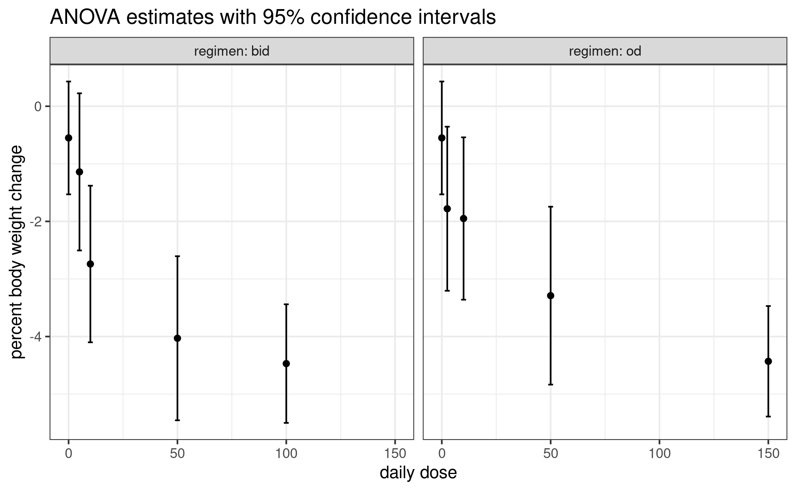
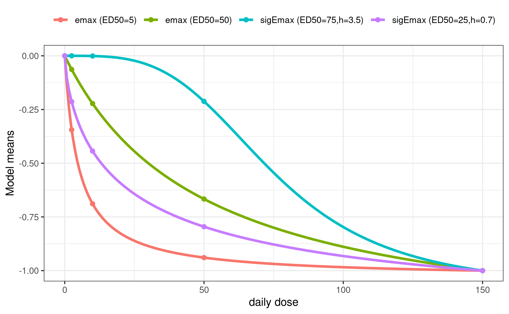
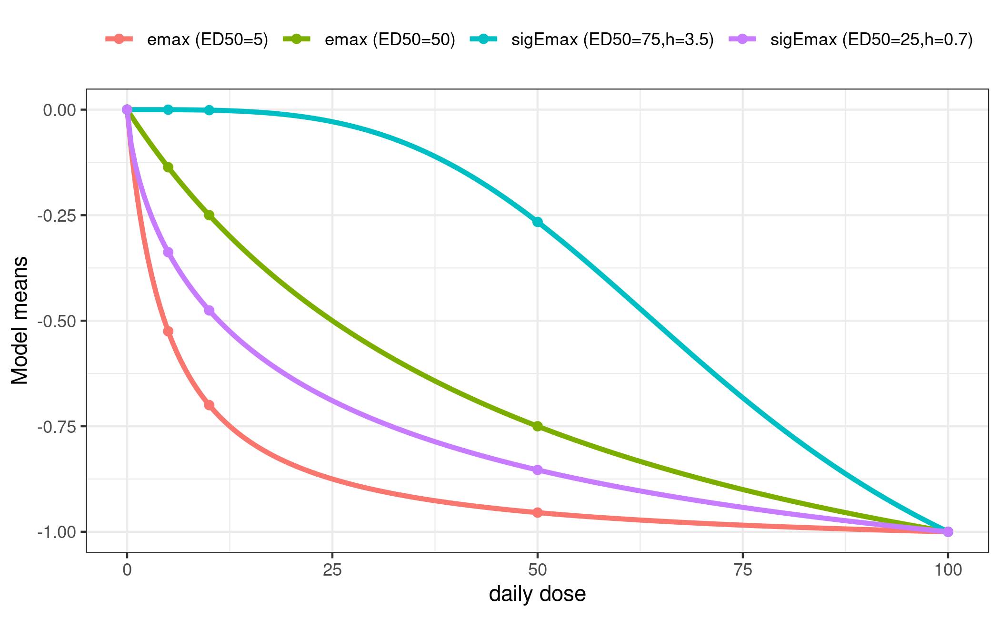
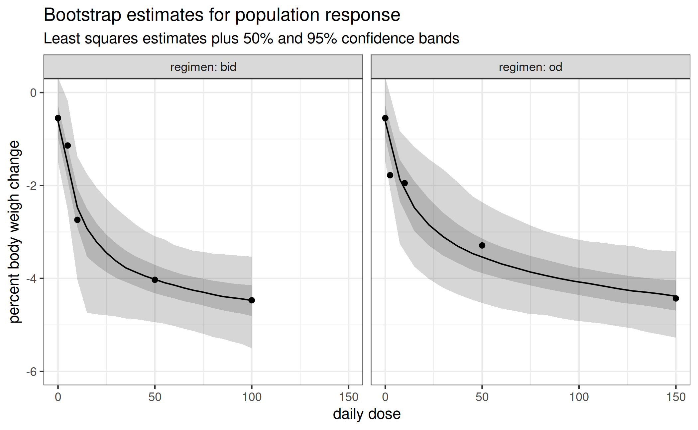

# Multiple Regimen MCP-Mod

## Background

Often more than one regimen is studied in dose-finding studies. If there
are enough doses within each regimen, one may still utilize MCP-Mod. But
specific assumptions are needed, and it depends on the situation,
whether or not these are appropriate (and thus usage of MCP-Mod).

The first idea is to bring the doses for each regimen on a common scale
(total dose per time unit). For example if once daily (od) dosing and
twice daily (bid) dosing are used in a study, one might utilize the
total daily dose.

It is usually not appropriate to then perform MCP-Mod on the total daily
dose (ignoring from which regimen the doses originate): The study
investigated more than one regimen, so assessing the difference between
regimen (for example for the same total daily dose) is of interest. This
would not be possible with a modelling approach that ignores the
regimen.

The most general approach would be to perform MCP-Mod separately by
regimen, and for example to adjust p-values originating from the
MCP-part using a Bonferroni correction. This approach assumes that the
regimen don’t share any similarity. Due to the double-blind nature of
trials, all patients would receive two administrations per day (patients
in the od group receive one placebo per day), so that there is no real
od group and in particular no separate placebo od group. So it often
makes more sense to assume that the placebo group is common to both the
od and bid dose-response curve. For the MCP-step contrasts for both od
and bid are taken with respect to the same placebo group and in the
modelling step one would assume the intercept to be the same across
regimen, but all other parameters separate.

One could also assume further parameters to be common across regimen
(for example the Emax or the ED50 parameter for the Emax model), but in
the following example no such assumption is made.

The motivation for the simulated data below is taken from a recently
completed dose-finding study, where the dose-response of the drug
Licogliflozin was assessed for the od and bid regimen ([Bays et al.
2020](#ref-bays2020)), see also the [corresponding page at
clinicaltrials.gov](https://clinicaltrials.gov/ct2/show/results/NCT03100058).

Note that this study used MCP-Mod, but the analysis presented here has
been modified and simplified (in terms of candidate models and
dose-response modelling strategy).

For most of the following code it is useful to structure the first-stage
estimates like this: \\ \hat\mu=(\hat\mu\_{\mathrm{placebo}},
\hat\mu\_{\mathrm{od}}, \hat\mu\_{\mathrm{bid}}) \\ The length of the
sub-vectors \\\hat\mu\_{\mathrm{od}}\\ and \\\hat\mu\_{\mathrm{bid}}\\
correspond to the number of different doses in the two regimens. They
can be different, but in our example both have 4 elements.

Also as discussed above everything is modeled on the total daily dose
scale.

``` r
library(DoseFinding)
library(ggplot2)
## collect estimates and dosage information in one place
example_estimates <- function() {
  ## ANOVA mean estimates and ci bounds extracted from fig. 3 of Bays (2020).
  ## clinicaltrials.gov page already seems to contain values from the dose-response model fit
  mn <- c(-0.55, -1.78, -1.95, -3.29, -4.43, -1.14, -2.74, -4.03, -4.47)
  lb <- c(-1.56, -3.15, -3.36, -4.85, -5.40, -2.49, -4.10, -5.50, -5.50)
  ub <- c( 0.40, -0.30, -0.54, -1.76, -3.48, 0.24, -1.38, -2.65, -3.44)
  se <- (ub - lb)/(2*qnorm(0.975)) # approximate standard error
  return(list(mu_hat = mn,
              daily_dose = c(0, 2.5, 10, 50, 150, 5, 10, 50, 100),
              S_hat = diag(se^2),
              # keep track of which elements correspond to which regimen:
              index = list(placebo = 1, od = 2:5, bid = 6:9)))
}

## restructure estimates for easy plotting with ggplot
tidy_estimates <- function(est) {
  se <- sqrt(diag(est$S_hat))
  tidy <- data.frame(daily_dose = est$daily_dose, mu_hat = est$mu_hat,
                     ub = est$mu_hat + qnorm(0.975) * se, lb = est$mu_hat - qnorm(0.975) * se)
  tidy <- rbind(tidy[1, ], tidy) # duplicate placebo
  tidy$regimen <- c("od", "bid", rep("od", length(est$index$od)), rep("bid", length(est$index$bid)))
  return(tidy)
}

plot_estimates <- function(est) {
  df <- tidy_estimates(est)
  ggplot(df, aes(daily_dose, mu_hat)) + geom_point() +
    geom_errorbar(aes(ymin = lb, ymax = ub)) +
    facet_wrap(vars(regimen), labeller = label_both) +
    xlab("daily dose") + ylab("percent body weight cange") +
    labs(title = "ANOVA estimates with 95% confindence intervals")
}

est <- example_estimates()
plot_estimates(est)
```



## Candidate models

Even though not necessary and not always desired we will use the same
candidate models for both regimen here.

``` r
mods <- list(
  od = Mods(emax = c(5, 50),
            sigEmax = rbind(c(75, 3.5), c(25, 0.7)),
            maxEff = -1,
            doses = est$daily_dose[c(est$index$placebo, est$index$od)]),
  bid = Mods(emax = c(5, 50),
             sigEmax = rbind(c(75, 3.5), c(25, 0.7)),
             maxEff = -1,
             doses=est$daily_dose[c(est$index$placebo, est$index$bid)]))

plotMods(mods$od, superpose = TRUE, xlab = "daily dose")
```



``` r
plotMods(mods$bid, superpose = TRUE, xlab = "daily dose")
```



## Multiple contrast test

The matrix of contrasts is built up from a separate matrix for each
regimen. We stick them together in such a way that we compare
\\\hat\mu\_{\mathrm{od}}\\ and \\\hat\mu\_{\mathrm{bid}}\\ with the
common placebo response estimate \\\hat\mu\_{\mathrm{placebo}}\\.

``` r
calculate_contrasts <- function(est, mods) {
  S_hat <- est$S_hat
  i <- est$index
  cm_od <- optContr(mods$od, S=S_hat[c(i$placebo, i$od), c(i$placebo, i$od)])$contMat
  cm_bid <- optContr(mods$bid, S=S_hat[c(i$placebo, i$bid), c(i$placebo, i$bid)])$contMat
  colnames(cm_od) <- paste0("od_", colnames(cm_od))
  rownames(cm_od)[-1] <- paste0("od_", rownames(cm_od)[-1])
  colnames(cm_bid) <- paste0("bid_", colnames(cm_bid))
  rownames(cm_bid)[-1] <- paste0("bid_", rownames(cm_bid)[-1])
  # now build a block matrix (contrasts in columns) like this:
  # [ row of placebo coefficients od   | row of placebo coefficients bid   ]
  # [----------------------------------+-----------------------------------]
  # [ remaining doses' coefficents od  | fill with all zeros               ]
  # [----------------------------------+-----------------------------------]
  # [ fill with all zeros              | remaining doses' coefficients bid ]
  cm_full <- rbind(
    "0"=c(cm_od[1,],                                cm_bid[1,]                              ),
    cbind(cm_od[-1,],                               matrix(0, nrow(cm_od) - 1, ncol(cm_bid))),
    cbind(matrix(0, nrow(cm_bid) - 1, ncol(cm_od)), cm_bid[-1, ]                            ))
  return(cm_full)
}

cont_mat <- calculate_contrasts(est, mods)
print(round(cont_mat, 2))
```

            od_emax1 od_emax2 od_sigEmax1 od_sigEmax2 bid_emax1 bid_emax2
    0           0.75     0.56        0.41        0.66      0.81      0.60
    od_2.5      0.14     0.22        0.19        0.18      0.00      0.00
    od_10      -0.08     0.13        0.20        0.03      0.00      0.00
    od_50      -0.20    -0.13        0.06       -0.16      0.00      0.00
    od_150     -0.61    -0.78       -0.87       -0.71      0.00      0.00
    bid_5       0.00     0.00        0.00        0.00      0.04      0.21
    bid_10      0.00     0.00        0.00        0.00     -0.08      0.13
    bid_50      0.00     0.00        0.00        0.00     -0.24     -0.21
    bid_100     0.00     0.00        0.00        0.00     -0.52     -0.73
            bid_sigEmax1 bid_sigEmax2
    0               0.41         0.72
    od_2.5          0.00         0.00
    od_10           0.00         0.00
    od_50           0.00         0.00
    od_150          0.00         0.00
    bid_5           0.21         0.12
    bid_10          0.21         0.02
    bid_50          0.02        -0.23
    bid_100        -0.86        -0.64

We also need to calculate the test statistics by hand.

``` r
mct_test <- function(cont_mat, est) {
  cont_cov <- t(cont_mat) %*% est$S_hat %*% cont_mat
  t_stat <- drop(est$mu_hat %*% cont_mat) / sqrt(diag(cont_cov))
  # FIXME: calling non-exported function
  p <- MCTpval(contMat = cont_mat, corMat = cov2cor(cont_cov),
               df=Inf, tStat=t_stat, alternative = "one.sided")
  ord <- rev(order(t_stat))
  return(data.frame(tStat = t_stat[ord], pVals = p[ord]))
}
mct_test(cont_mat, est)
```

                    tStat        pVals
    bid_sigEmax2 6.027666 1.669425e-09
    bid_emax2    5.916858 3.346921e-09
    bid_emax1    5.832739 5.574630e-09
    od_sigEmax2  5.710927 1.151087e-08
    od_emax2     5.640589 1.752113e-08
    od_emax1     5.504042 6.425687e-08
    od_sigEmax1  5.200171 2.689264e-07
    bid_sigEmax1 5.006107 9.856002e-06

A clear dose-response trend can be established for both regimen.

## Dose-response modelling

Dose-response estimation needs a handful of auxiliary functions. The
model for \\\hat\mu\\ has a common intercept parameter for both regimen
together and two sets of the remaining parameters of the family in
question. For example, a model based on the Emax family has 5
parameters: one common `e0`, `(eMax, ed50)` for the od regimen, and
`(eMax, ed50)` for the bid regimen.

The following function calculates the responses given dose values and a
model family.

``` r
## calculate response under `model` for od/bid with common e0, but separate remaining parameters
## arguments:
## - model: as a string like "emax",
## - i_par: list of vectors named "placebo", "od", "bid", used for indexing `par`
## - par: numeric, model parameter structured as c(e0, pars_od, pars_bid)
## returns: response at placebo, dose_od, dose_bid (in this order)
eval_model_shared_e0 <- function(model, dose_od, dose_bid, par, i_par) {
  resp_placebo <- par[1] # e0
  resp_od <- do.call(model, append(list(dose_od, par[1]), as.list(par[i_par$od])))
  resp_bid <- do.call(model, append(list(dose_bid, par[1]), as.list(par[i_par$bid])))
  resp <- c(resp_placebo, resp_od, resp_bid)
  return(resp)
}
```

Next, we need to be able to fit a model family to the observed
\\\hat\mu\\. For this we employ the usual generalized MCP-Mod approach,
i.e. generalized least squares with the estimated covariance matrix
\\\hat S\\ ([Pinheiro et al. 2014](#ref-pinheiro2014)).

``` r
## find sensible starting values for `fit_model_shared_e0` by fitting separate models,
## index:  list of vectors named "placebo", "od", "bid", used for indexing `dose`
## bounds: passed through to `fitMod`
calc_start_values <- function(model, full_mu, full_S, dose, index, bounds) {
  separate_coefs <- sapply(c("od", "bid"), function(regimen) {
    inds <- c(index$placebo, index[[regimen]])
    coef(fitMod(dose[inds], full_mu[inds], S = full_S[inds, inds],
                type = "general",  model = model, bnds = bounds))[-1] # drop e0 estimate
  })
  ## remove names to prevent error in do.call() in eval_model_shared_e0;
  ## od, bid coefs are in 1st / second column
  start <- c(full_mu[1], as.numeric(separate_coefs), use.names=FALSE)
  return(start)
}

## fits 'model' to mu_hat with GLS (using S_hat_inv as weight matrix), using a common e0 for od and bid regimens.
## i_reg:  list of vectors named "placebo", "od", "bid", used for indexing `dose`
## i_par: passed through to `eval_model_shared_e0`
## dose: numeric with doses for placebo, od, bid
## lower, upper, start: control parameters fro `nlminb`
fit_model_shared_e0 <- function(model, dose, mu_hat, S_hat_inv, lower, upper, start, i_reg, i_par) {
  opt_fun <- function(par) { # make use of lexical scope
    resp <- eval_model_shared_e0(model, dose[i_reg$od], dose[i_reg$bid], par, i_par)
    delta <- resp - mu_hat
    return(drop(t(delta) %*% S_hat_inv %*% delta))
  }
  fit <- nlminb(start, opt_fun, lower = lower, upper = upper)
  return(fit)
}
```

Finally, instead of only fitting a single model, we use the same
bootstrap-plus-averaging approach that is detailed in the [vignette for
analysis of continuous
data](https://openpharma.github.io/DoseFinding/articles/analysis_normal.html#dose-response-estimation).

``` r
## predict population response in each regimen for dose_seq_*
## note: both dose_seq_* vectors should contain a 0 if response at placebo is of interest
one_bootstrap_sample <- function(est, dose_seq_od, dose_seq_bid) {
  mu_new <- drop(mvtnorm::rmvnorm(1, est$mu_hat, est$S_hat))
  mod_info <- list(list(name = "emax", bounds = rbind(c(0.15, 225)),
                        i_par = list(od = 2:3, bid = 4:5), n_par_gaic = 5),
                   list(name = "sigEmax", bounds = rbind(c(0.15, 225), c(0.5, 5)),
                        i_par = list(od = 2:4, bid = 5:7), n_par_gaic = 7))
  fit <- lapply(mod_info, function(m) {
    start <- calc_start_values(m$name, mu_new, est$S_hat, est$daily_dose, est$index, m$bounds)
    low <- c(-Inf, -Inf, m$bounds[,1]) # no bounds on e0, eMax
    up <- c(Inf, Inf, m$bounds[,2])
    fit_model_shared_e0(m$name, est$daily_dose, mu_new, solve(est$S_hat), lower = low,  upper = up,
                        start = start, i_reg = est$index, i_par = m$i_par)
  })
  ## calculate gAICs
  gaics <- sapply(fit, `[[`, "objective") + 2 * sapply(mod_info, `[[`, "n_par_gaic")
  sel <- which.min(gaics)
  mod <- mod_info[[sel]]
  ## drop the placebo element
  pred <- eval_model_shared_e0(mod$name, dose_seq_od, dose_seq_bid, fit[[sel]]$par, mod$i_par)[-1]
  return(pred)
}

summarize_bootstrap_samples <- function(samples, probs = c(0.025, 0.25, 0.75, 0.975)) {
  stopifnot(length(probs) == 4)
  med <- apply(samples, 1, median)
  quants <- apply(samples, 1, quantile, probs = probs)
  bs_df <- as.data.frame(cbind(med, t(quants)))
  names(bs_df) <- c("median", "low_out", "low_in", "high_in", "high_out")
  return(bs_df)
}

dose_seq_od <- seq(0, 150, length.out = 21) # do include placebo!
dose_seq_bid <- seq(0, 100, length.out = 21)
set.seed(1, kind = "Mersenne-Twister", sample.kind = "Rejection", normal.kind = "Inversion")
reps <- replicate(1000, one_bootstrap_sample(est, dose_seq_od, dose_seq_bid))
bs_sum <- summarize_bootstrap_samples(reps)
bs_sum$daily_dose <- c(dose_seq_od, dose_seq_bid)
bs_sum$regimen <- c(rep("od", length(dose_seq_od)), rep("bid", length(dose_seq_bid)))

ggplot(bs_sum) + geom_ribbon(aes(daily_dose, ymin=low_out, ymax=high_out), alpha = 0.2) +
  geom_ribbon(aes(daily_dose, ymin=low_in, ymax=high_in), alpha = 0.2) +
  geom_line(aes(daily_dose, median)) +
  geom_point(aes(daily_dose, mu_hat), tidy_estimates(est)) +
  facet_wrap(vars(regimen), labeller = label_both) +
  labs(title = "Bootstrap estimates for population response",
       subtitle = "Least squares estimates plus 50% and 95% confidence bands") +
  xlab("daily dose") + ylab("percent body weigh change") +
  coord_cartesian(ylim = c(-6, 0))
```



## References

Bays, H. E., Kozlovski, P., Shao, Q., Proot, P., and Keefe, D. (2020),
“Licogliflozin, a novel SGLT1 and 2 inhibitor: Body weight effects in a
randomized trial in adults with overweight or obesity,” *Obesity*, 28,
870–881. <https://doi.org/10.1002/oby.22764>.

Pinheiro, J., Bornkamp, B., Glimm, E., and Bretz, F. (2014),
“Model-based dose finding under model uncertainty using general
parametric models,” *Statistics in Medicine*, 33, 1646–1661.
<https://doi.org/10.1002/sim.6052>.
