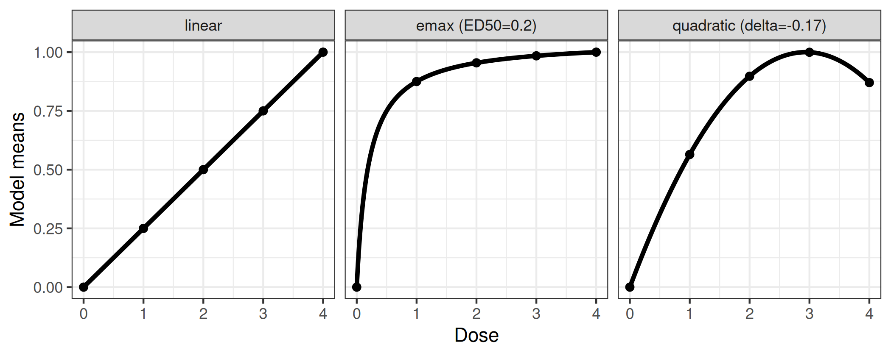

# Overview DoseFinding package

The DoseFinding package provides functions for the design and analysis
of dose-finding experiments (for example pharmaceutical Phase II
clinical trials). It provides functions for: multiple contrast tests
(`MCTtest` for analysis and `powMCT`, `sampSizeMCT` for sample size
calculation), fitting non-linear dose-response models (`fitMod` for ML
estimation and `bFitMod` for Bayesian and bootstrap/bagging ML
estimation), calculating optimal designs (`optDesign` or `calcCrit` for
evaluation of given designs), both for normal and general response
variable. In addition the package can be used to implement the MCP-Mod
procedure, a combination of testing and dose-response modelling
(`MCPMod`) (Bretz et al. ([2005](#ref-bretz2005)), Pinheiro et al.
([2014](#ref-pinheiro2014))). A number of vignettes cover practical
aspects on how MCP-Mod can be implemented using the DoseFinding package.
For example a
[FAQ](https://openpharma.github.io/DoseFinding/articles/faq.md) document
for MCP-Mod, analysis approaches for
[normal](https://openpharma.github.io/DoseFinding/articles/analysis_normal.md)
and
[binary](https://openpharma.github.io/DoseFinding/articles/binary_data.md)
data, [sample size and power
calculations](https://openpharma.github.io/DoseFinding/articles/sample_size.md)
as well as handling data from more than one dosing
[regimen](https://openpharma.github.io/DoseFinding/articles/mult_regimen.md)
in certain scenarios.

Below a short overview of the main functions.

## Perform multiple contrast test

``` r

library(DoseFinding)
data(IBScovars)
head(IBScovars)
```

      gender      resp dose
    1      1 1.5769231    1
    2      1 0.6833333    3
    3      1 0.2857143    0
    4      1 0.6307692    3
    5      1 0.1428571    2
    6      1 0.1571429    1

``` r

## perform (model based) multiple contrast test
## define candidate dose-response shapes
models <- Mods(linear = NULL, emax = 0.2, quadratic = -0.17,
               doses = c(0, 1, 2, 3, 4))
## plot models
plotMods(models)
```



``` r

## perform multiple contrast test
## functions powMCT and sampSizeMCT provide tools for sample size
## calculation for multiple contrast tests
test <- MCTtest(dose, resp, IBScovars, models=models,
                addCovars = ~ gender)
test
```

    Multiple Contrast Test

    Contrasts:
      linear   emax quadratic
    0 -0.616 -0.889    -0.815
    1 -0.338  0.135    -0.140
    2  0.002  0.226     0.294
    3  0.315  0.252     0.407
    4  0.638  0.276     0.254

    Contrast Correlation:
              linear  emax quadratic
    linear     1.000 0.768     0.843
    emax       0.768 1.000     0.948
    quadratic  0.843 0.948     1.000

    Multiple Contrast Test:
              t-Stat   adj-p
    emax       3.208 0.00173
    quadratic  3.083 0.00242
    linear     2.640 0.00855

## Fit non-linear dose-response models here illustrated with Emax model

``` r

fitemax <- fitMod(dose, resp, data=IBScovars, model="emax",
                  bnds = c(0.01,5))
## display fitted dose-effect curve
plot(fitemax, CI=TRUE, plotData="meansCI")
```


## Calculate optimal designs, here illustrated for target dose (TD) estimation

``` r

## optimal design for estimation of the smallest dose that gives an
## improvement of 0.2 over placebo, a model-averaged design criterion
## is used (over the models defined in Mods)
doses <- c(0, 10, 25, 50, 100, 150)
fmodels <- Mods(linear = NULL, emax = 25, exponential = 85,
                logistic = c(50, 10.8811),
                doses = doses, placEff=0, maxEff=0.4)
plot(fmodels, plotTD = TRUE, Delta = 0.2)
```


``` r

weights <- rep(1/4, 4)
desTD <- optDesign(fmodels, weights, Delta=0.2, designCrit="TD")
desTD
```

    Calculated TD - optimal design:
          0      10      25      50     100     150 
    0.34960 0.09252 0.00366 0.26760 0.13342 0.15319 

``` r

plot(desTD, fmodels)
```


## References

Bretz, F., Pinheiro, J. C., and Branson, M. (2005), “Combining multiple
comparisons and modeling techniques in dose-response studies,”
*Biometrics*, Wiley Online Library, 61, 738–748.
<https://doi.org/10.1111/j.1541-0420.2005.00344.x>.

Pinheiro, J., Bornkamp, B., Glimm, E., and Bretz, F. (2014),
“Model-based dose finding under model uncertainty using general
parametric models,” *Statistics in Medicine*, 33, 1646–1661.
<https://doi.org/10.1002/sim.6052>.
